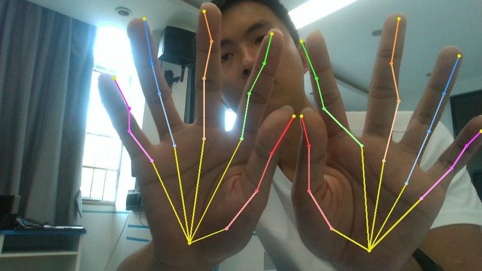

# Transfer Parameters from PyTorch to PaddlePaddle

## Description

Copy parameters from pytorch to paddlepaddle for [InterHand2.6M](https://github.com/facebookresearch/InterHand2.6M).
PyTorch weights can be downloaded from the source repository.

`speed_test.py` uses paddlepaddle api to simulate `torch.gather`. speed differences between `concat`&`gather_nd` and `for-loop` shows below:

| api | joint_y | joint_z |
| :--: | :--: | :--: |
| `concat`&`gather_nd` | 0.00s | 0.00s|
| `for-loop` | 0.44s | 0.59s|

There is a difference between the pytorch model output heatmap and the transferred paddlepaddle model output heatmap. 
Detail information can be shown by running `heatmap_compare.py` or `resnet_compare.py`.

| model | heatmap_diff | coord_diff|
| :---: | :--: | :--: |
| interhand | 0.01076 | 0.00021 | 
| resnet | 0.000181 | |